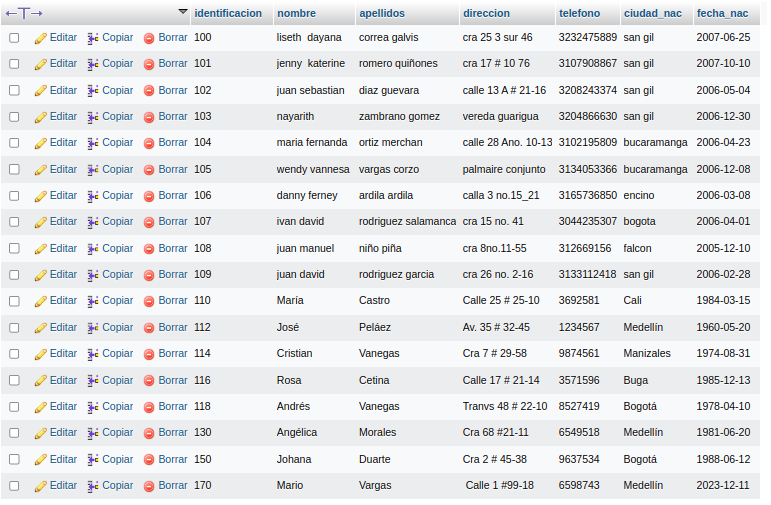
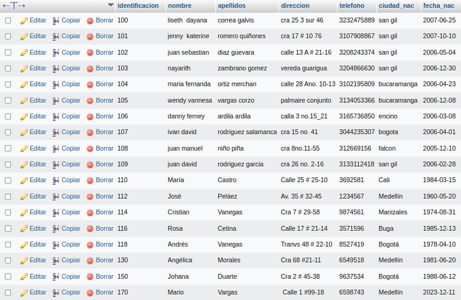
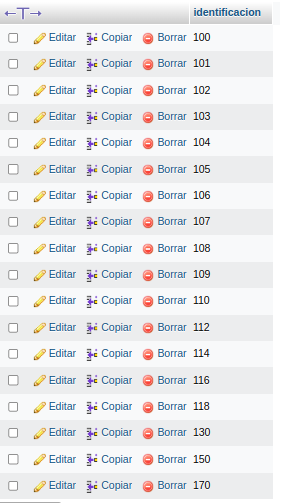
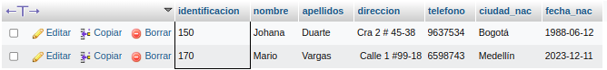

# phpmyAdmin
Avance de nuevos ejemplos en phpmyadmin
# consulta_1_sql
# Introduccion a las consultas a una BD usando el lenguaje SQL

## Base de datos: Ventas
## Tabla: Cliente

## Instruccion SELECT
- permite seleccionar datos de una tabla
- su formto es: `SELECT campos_tabla FROM nombre tabla``

### consulta No. 1 
1. para visualizar toda la informacion que contiene la tabla cliente se puede incluir con la instruccio SELECT el caracter **\*** caa uno de los campos de la tabla.

- `SELECT * FROM Cliente`

- `SELECT identificacion, nombre, apellidos, 
direccion, telefono, ciudad_nac, fecha_nac FROM Cliente`

### consulta No. 2

2. para visualizar solamente la identificacion del cliente:`SELECT identificacion FROM Cliente`

### consulta No. 3

3. si se desea obtener los registros cuya identificacion sea mayor o igual a 150, se debe utilizar la cláusula `WHERE` que especifica las condiciones que deben reunir los registros que se van a seleccionar: `SELECT * FROM Cliente Where identificacion>=150`

### Consulta No. 4